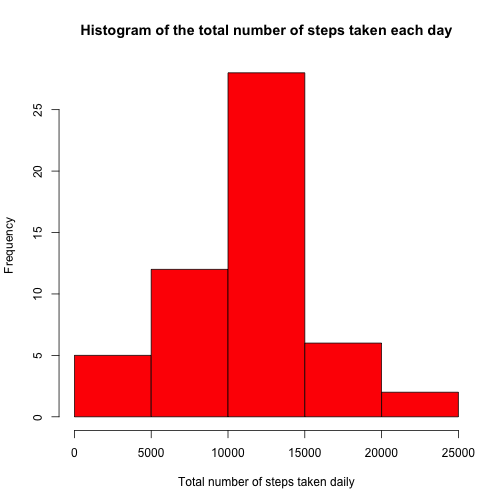
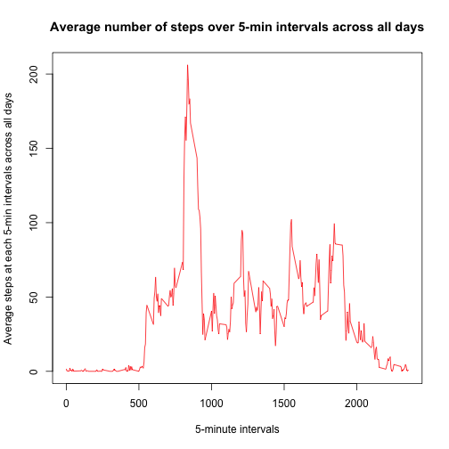
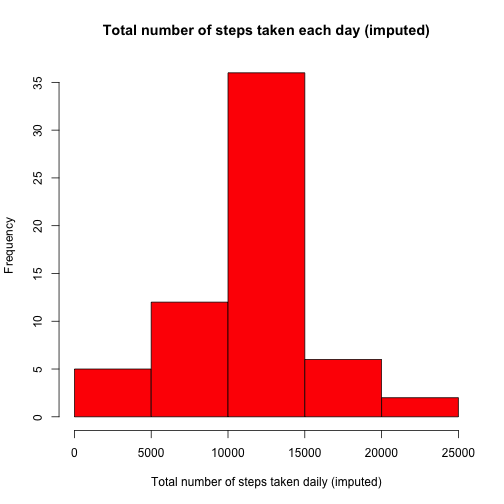
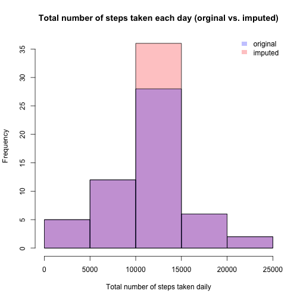
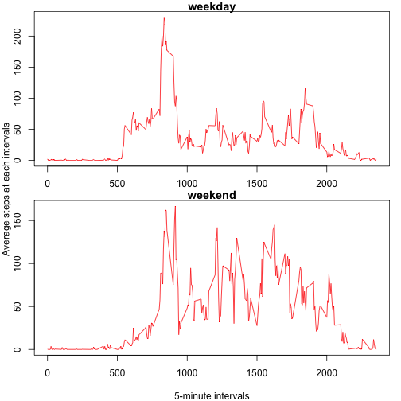

## Loading and preprocessing the data

```r
if (!file.exists("activity.csv")) {
  unzip("activity.zip")  # only unzip if file has not been unzipped yet.
}

# Specify row numbers to help memory usage when reading in.
row.total = 17568  
time.format = "%Y-%m-%d"
col.classes <- c("numeric", "character", "numeric")
# Pick colors for original & imputed plots
origin.col <- rgb(0, 0, 1, 1/4)
impute.col <- rgb(1, 0, 0, 1/4)

data <- read.csv("activity.csv", header = T, na.strings = "NA",
                 nrows = row.total, colClasses = col.classes)
```

## What is mean total number of steps taken per day
Subset non-NA step data and calculate the total number of steps for each day.

```r
data.clean <- data[!is.na(data$steps), ]  # subset non-NA step data
date.clean.f <- factor(data.clean$date)
steps.daily <- unlist(tapply(data.clean$steps, date.clean.f, sum, simplify = F))
```
The histogram of the total number of steps taken each day:  

```r
# 1. Make a histogram of the total number of steps taken each day
hist(steps.daily, col = "red",
     main = "Histogram of the total number of steps taken each day",
     xlab = "Total number of steps taken daily")
```

 

The __mean total number of steps taken per day__ is:  

```r
mean.total <- mean(steps.daily)
mean.total
```

```
## [1] 10766.19
```
The __median total number of steps taken per day__ is:  

```r
median.total <- median(steps.daily)
median.total
```

```
## [1] 10765
```


## What is the average daily activity pattern?
1. Make a time series plot (i.e. type = "l") of the 5-minute interval (x-axis)
and the average number of steps taken, averaged across all days (y-axis):  
    
    ```r
    interval.f <- factor(data.clean$interval)
    avg.steps.interval <- unlist(tapply(data.clean$steps, interval.f, mean,
                                        simplify = F))
    
    plot(levels(interval.f), avg.steps.interval, type = "l", col = "red",
         main = "Average number of steps over 5-min intervals across all days",
         xlab = "5-minute intervals",
         ylab = "Average steps at each 5-min intervals across all days")
    ```
    
     

2. Time interval that has the __maximum average number of steps across all days__:  
    
    ```r
    names(avg.steps.interval[avg.steps.interval == max(avg.steps.interval)])
    ```
    
    ```
    ## [1] "835"
    ```

## Imputing missing values
1. The __total number of missing values__ in the dataset (i.e. the total number
    of rows with NAs):  
    
    ```r
    sum(is.na(data$steps))
    ```
    
    ```
    ## [1] 2304
    ```

2. __Imputation Strategy__: filling each missing values with the mean of its
corresponding 5-minute interval across all days then create a new dataset that
is equal to the original dataset but with the missing data filled in. 
    
    ```r
    days <- length(levels(factor(data$date)))  # use date from raw data to be safe
    imput <- unname(rep(avg.steps.interval, days))
    data.imputed <- data
    data.imputed$steps[is.na(data.imputed$steps)] <- imput[is.na(data.imputed$steps)]
    ```
3. The histogram of the __imputed total number of steps taken each day__:  
    
    ```r
    hist(steps.daily.imputed, col = "red",
         main = "Total number of steps taken each day (imputed)",
         xlab = "Total number of steps taken daily (imputed)")
    ```
    
     

4. The __mean__ of the __imputed__ total number of steps taken per day:  
    
    ```r
    mean.imputed.total <- mean(steps.daily.imputed)
    mean.imputed.total
    ```
    
    ```
    ## [1] 10766.19
    ```

    The __median__ of the __imputed__ total number of steps taken per day:  
    
    ```r
    median.imputed.total <- median(steps.daily.imputed)
    median.imputed.total
    ```
    
    ```
    ## [1] 10766.19
    ```

    After imputation, mean and median are equal whereas before the median is less
    than mean. And the __impact of imputing missing data__ is that the frequency
    of the total number of steps taken daily between 10,000 and 15,000 has
    increased, as shown in the plot below:  
    
    ```r
    # Plot the imputed data
    hist(steps.daily.imputed, col = impute.col,
         main = "Total number of steps taken each day (orginal vs. imputed)",
         xlab = "Total number of steps taken daily")
    # Plot the original data
    hist(steps.daily, add = T, col = origin.col)
    legend("topright", legend = c("original", "imputed"),
           fill = c(origin.col, impute.col), border = NA, bty = "n")
    ```
    
     

## Are there differences in activity patterns between weekdays and weekends?
The following codes first creates a new factor variable in the dataset with two
levels: "weekday" and "weekend". Then it splits the dataset by these two
factors and computes the __average steps for each interval averaged across all
weekday days or weekend days__:  

```r
# Create a new factor variable w/ 2 levels: "weekday" and "weekend" 
weekend.val <- c("Saturday", "Sunday")
date.weekdays <- weekdays(strptime(data.imputed$date, time.format))
date.weekdays[date.weekdays %in% weekend.val] <- "weekend"
date.weekdays[date.weekdays != "weekend"] <- "weekday"
data.imputed.v2 <- cbind(data.imputed, weekday.weekend = factor(date.weekdays))

# Split dataframe into a list of dataframes by "weekend"
list.data.imputed.by.weekend <- split(data.imputed.v2,
                                     data.imputed.v2$weekday.weekend)  
# For each dataset in the list, compute the average steps over all intervals 
interval.imputed.f <- factor(data.imputed.v2$interval)
result.list <- lapply(list.data.imputed.by.weekend,
                      function(x) unlist(tapply(x$steps, factor(x$interval),
                                                mean, simplify = F)))
# Plot results in the list
par(mfrow = c(length(result.list), 1), 
    oma = c(2, 2, 0, 0),
    mar = c(2, 1, 1, 1),
    xpd = NA)
result <- lapply(names(result.list),
                 function(x) plot(levels(interval.imputed.f),
                                  result.list[[x]], type = "l", col = "red",
                                  main = x, xlab = NA, ylab = NA))
title(xlab = "5-minute intervals",
      ylab = "Average steps at each intervals",
      outer = TRUE, line = 1)
```

 
